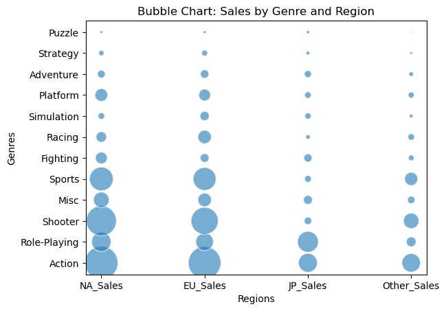
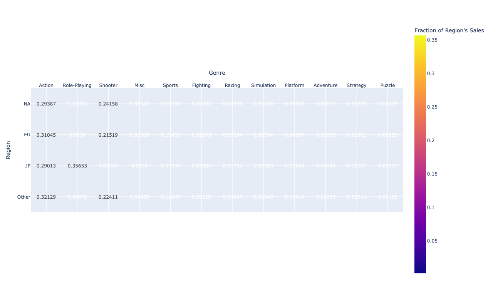
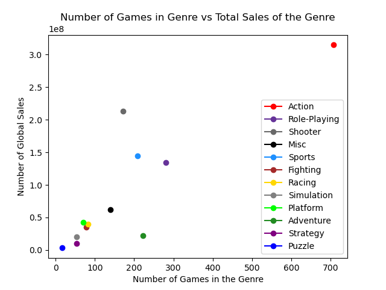
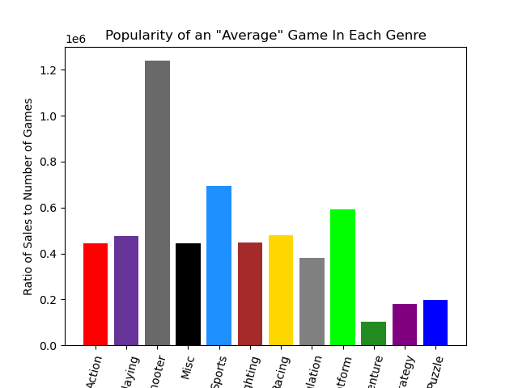

# Video-games Sales Analysis
Relational database project for aircraft incidents using R. Includes scripts for loading, cleaning, and exploring incidents dataset. 

## Files
- `clean.py`- Clean dataset.
- `analysis.py`- Analysis functions 1.
- `analysis2.py`- Analysis functions 2.
- `bubblechart.py`- Script for bubble chart.
- `heatmap.py`- Script for heatmap. 
- `misc.py`- Other analysis functions.
- `conclusion.py`- Conclusion using all functions. 

- `vgsales.csv`- Video-games sales CSV

## Charts
- 
- 
- 
- 
